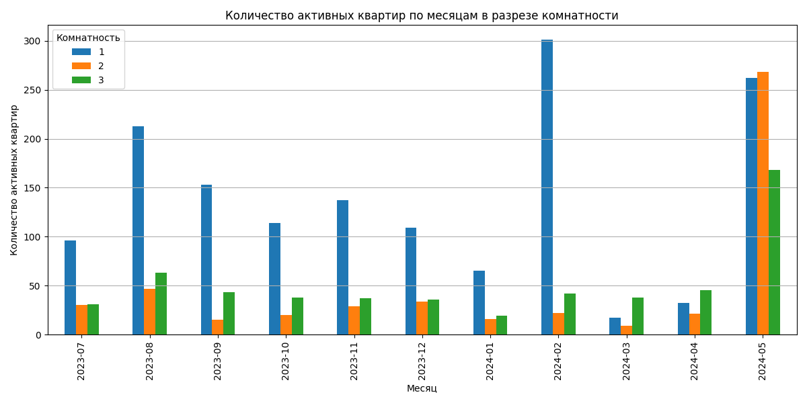

# 📊 Анализ экспозиции квартир ТДСК (2 полугодие 2023)

## 📌 Задание

На основе выгрузки уникальных квартир застройщика ТДСК, необходимо:

1. Создать **сводную таблицу** с количеством **активных квартир по каждому корпусу** на **каждую дату**.
2. Построить **график по месячному количеству активных квартир в разрезе комнатности**.

> Активной считается квартира, если поле `actualized_at` ≥ текущей даты в отчёте.  
> Под **уникальным корпусом** понимается адрес до слов `подъезд`, `кв.`, `квартира`.

---

## 🛠 Используемые технологии

- Python 3
- Pandas
- Matplotlib
- RegEx

---

## 📁 Структура проекта

```
.
├── data/
│   └── tdsk.csv                     # исходная выгрузка
├── output/
│   ├── active_objects_by_day.csv   # таблица с активными квартирами по корпусам
│   └── active_by_room_month.png    # график по комнатности
├── main.py                         # основной скрипт
└── README.md
```

---

## ▶️ Запуск

```bash
pip install pandas matplotlib
python main.py
```

---

## 📊 Результаты

### 1. Сводная таблица

Файл: `output/active_objects_by_day.csv`  
Содержит поля:

| Дата       | Корпус (адрес до подъезда)                     | Кол-во активных квартир |
|------------|------------------------------------------------|-------------------------|
| 2023-07-03 | ул. Александра Митинского, д. 4, (ГП 3.8)      | 1                       |
| ...        | ...                                            | ...                     |

---

### 2. График: Кол-во квартир по комнатности и месяцам

Файл: `output/active_by_room_month.png`



#### 📈 Анализ:
- **1-комнатные квартиры** доминируют в каждый месяц 2023 года.
- Пик активности — **вторая половина лета и ноябрь 2023**.
- **3-комнатные квартиры** представлены менее активно, но стабильно.
- Мая 2024 года является **аномальным**, вероятнее всего в это время актуальзируется вся база данных. 

---

## ✅ Итог

- Предобработка, агрегация и визуализация выполнены средствами Python.
- Все результаты сохранены в удобных форматах.
